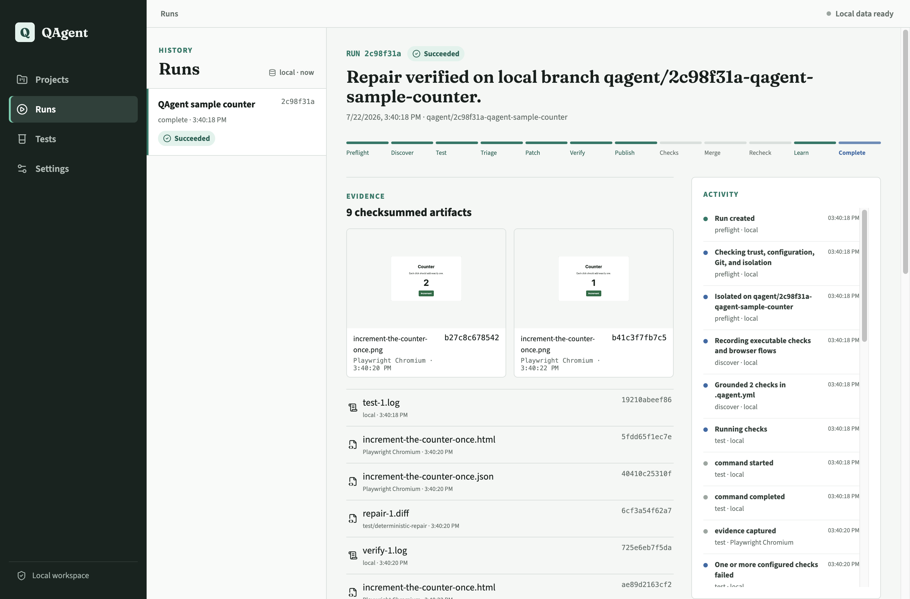

# QAgent

QAgent is a local-first QA repair agent for individual web developers. It runs grounded checks in an
isolated Git worktree, captures evidence, asks a configured model to diagnose and patch a failure,
verifies the change, and can publish the verified branch through GitHub policy.

The same durable engine powers a cross-platform Electron desktop app, a CLI, and an MCP server. Runs,
events, artifacts, and provider provenance live in local SQLite and survive restarts. Cloud services
are adapters, not prerequisites.

> **v0.2 is a breaking beta.** The v0.1.0 tag remains in Git history, but the old operational Next.js
> APIs, Expo client, Marimo dashboard, and Redis runtime are intentionally not compatible.



## What Defines QAgent

- **Grounded:** Every displayed result has a source, observation time, and availability state. QAgent
  does not generate random metrics, fake GitHub activity, silent model fallbacks, or ambiguous zeros.
- **Local-first:** SQLite, artifacts, Git worktrees, and Chrome/Chromium are local by default. Only one
  configured model provider is needed to repair a failure.
- **Checkout-safe:** A mutation run uses a new `qagent/<run>-<slug>` worktree and never modifies the
  developer's active checkout.
- **Policy-aware:** Dirty checkouts block publication. Authentication, workflow, dependency, lockfile,
  migration, secret-policy, and `.qagent.yml` changes cannot auto-merge.
- **One engine:** Desktop IPC, CLI, and MCP consume the same `@qagent/contracts` schemas and
  `QAgentEngine`; there is no parallel HTTP domain model.
- **Open:** QAgent is licensed under AGPL-3.0 and is designed to be useful without a QAgent cloud.

## Quickstart From Source

Requirements: Node 24, pnpm 11.15.1, Git, a Chrome-compatible browser, and one supported model.

```bash
corepack enable
corepack prepare pnpm@11.15.1 --activate
pnpm install --frozen-lockfile
pnpm qagent doctor
pnpm dev
```

The desktop first-run flow guides you through repository selection, workspace trust, command
detection, browser verification, model connection, GitHub autonomy, optional Weave disclosure, and a
final Doctor check.

For the CLI:

```bash
pnpm qagent init /absolute/path/to/project
pnpm qagent project add /absolute/path/to/project --trust
pnpm qagent run start <project-id>
pnpm qagent run show <run-id>
```

Use `--json` for stable JSON output. A live `run start --json` emits NDJSON events followed by the
terminal result. Run `pnpm qagent --help` for all commands and exit-code meanings.

## Project Configuration

QAgent detects Node, Python, Ruby, Go, Java, and .NET projects, but repository commands are never
executed until the canonical workspace path is trusted. Commit a `.qagent.yml` when detection is
ambiguous or when you need explicit behavior:

```yaml
# yaml-language-server: $schema=https://rishabhcli.github.io/QAgent/schema/v1.json
version: 1
test:
  commands:
    - executable: pnpm
      args: [test]
model:
  provider: openai
  model: gpt-5-mini
publish:
  provider: local
```

Commands are executable/argument arrays rather than shell strings. The published JSON Schema is
generated from the same Zod contract used by desktop, CLI, MCP, and the engine.

## Architecture

```text
Sandboxed React renderer ── validated IPC ── Electron main / safeStorage
                                                │
                                                ▼
CLI ─────────────┐                       UtilityProcess
MCP over stdio ──┼── @qagent/contracts ── QAgentEngine
Desktop IPC ─────┘                              │
                         ┌──────────────────────┼──────────────────────┐
                         ▼                      ▼                      ▼
                    SQLite WAL            Git worktrees         local artifacts
                         │                      │                      │
                         └──── model/browser/GitHub/Weave adapters ───┘
```

The durable state machine is:

```text
preflight -> discover -> test -> triage -> patch -> verify -> publish
          -> wait_checks -> merge -> postverify -> learn -> complete
```

`failed`, `cancelled`, and `policy_blocked` are explicit terminal outcomes. Run events use UUIDs,
monotonic sequence numbers, schema versions, timestamps, provenance, typed payloads, and artifact
references.

See [Architecture](./docs/ARCHITECTURE.md), [Threat Model](./docs/THREAT_MODEL.md), and the
[static documentation source](./apps/docs/app/content.ts) for details.

## Repository Layout

```text
apps/desktop/             Electron Forge + Vite + React desktop application
apps/docs/                Next.js static documentation for GitHub Pages
packages/contracts/       Shared Zod schemas and public interface types
packages/core/            Durable state machine and QAgentEngine
packages/storage/         SQLite migrations, records, leases, and artifacts
packages/adapters/        Git, browser, model, GitHub, Redis import, and Weave boundaries
packages/cli/             Human and JSON/NDJSON command-line interface
packages/mcp/             Trusted-project MCP server over stdio
fixtures/sample-web-app/  Deterministic real repair fixture
tests/                    Unit, integration, contract, desktop, and accessibility tests
```

## Supported Adapters

| Capability                 | Default                   | v0.2 status              |
| -------------------------- | ------------------------- | ------------------------ |
| SQLite                     | Local                     | Required, end-to-end     |
| Chrome, Edge, Chromium     | Local                     | Required, end-to-end     |
| OpenAI, Anthropic, Google  | Optional cloud            | Built in                 |
| OpenAI-compatible / Ollama | Optional local or cloud   | Built in                 |
| GitHub publication         | Optional                  | Only certified publisher |
| Browserbase                | Optional                  | Available adapter        |
| Weave                      | Optional, explicit opt-in | Redacted tracing adapter |
| Redis                      | Migration only            | `qagent migrate redis`   |
| Vercel, Daytona            | Optional                  | Not certified in v0.2    |

No credential means fully local operation except for the chosen model endpoint. An unavailable
provider fails visibly; runtime code never substitutes a deterministic or fake model.

## Development

```bash
pnpm schema
pnpm format:check
pnpm lint
pnpm typecheck
pnpm test:coverage
pnpm build
pnpm package
```

The deterministic fixture intentionally starts broken. Tests copy it into a temporary Git repository,
run the actual engine with a test-only model double, verify the patch in a worktree, and compare CLI,
MCP, and desktop contracts.

Release gates reject formatting drift, ESLint warnings in first-party code, TypeScript errors, failed
tests or packaging, committed secrets, CodeQL findings, and unaccepted critical/high production
advisories.

## Privacy And Security

Repository source, raw screenshots, DOM evidence, logs, patches, and credentials stay local by
default. Weave tracing activates only after credentials and explicit disclosure acceptance; local
redaction strips tokens, authorization headers, environment values, and secret-like content before
delivery. Weave failure never blocks a run.

See [Security Policy](./SECURITY.md), [Data Policy](./docs/DATA_POLICY.md), and
[Threat Model](./docs/THREAT_MODEL.md).

## Contributing

Read [CONTRIBUTING.md](./CONTRIBUTING.md) and [GOVERNANCE.md](./docs/GOVERNANCE.md). By
contributing, you agree that your work is licensed under [AGPL-3.0](./LICENSE).
